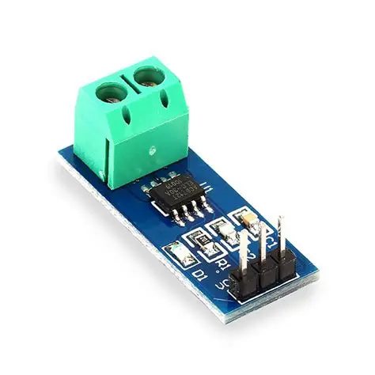
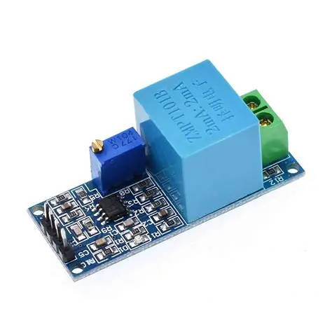
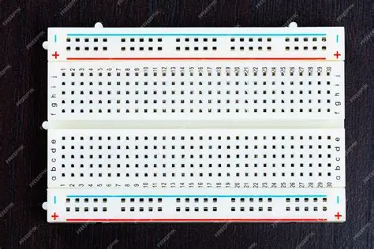
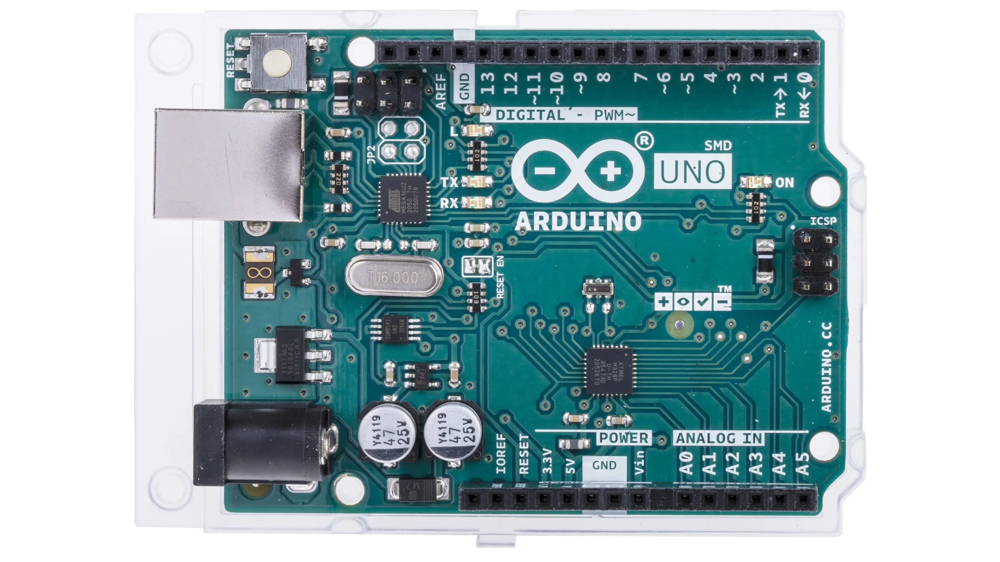
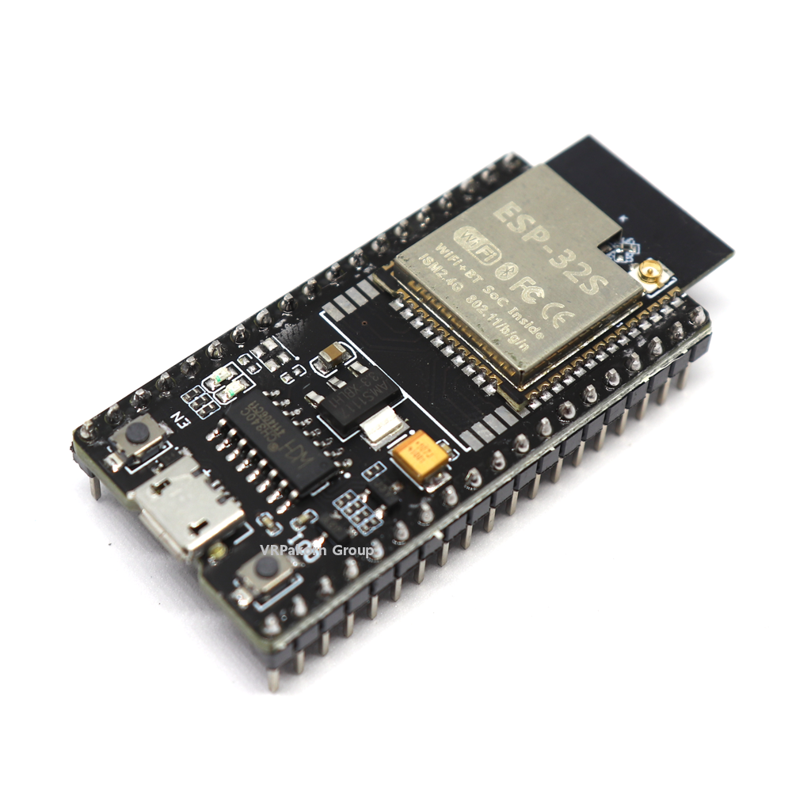

# IoT-based-Smart-Electricity-Meter
IoT-Based Smart Electricity Meter is a smart system that monitors household electricity usage in real time. It helps users track power consumption, estimate electricity bills, and reduce energy wastage through an IoT-based dashboard or mobile application.
## Overview

The IoT-Based Smart Electricity Meter is an advanced energy monitoring and management system designed to improve the efficiency of electricity usage in homes, apartments, offices, and small industries. Electricity plays an important role in our daily life, as almost every household appliance depends on electrical power for operation. However, many users are unaware of how much electricity they consume regularly, which appliances use more energy, and how their electricity bills increase every month. Due to the lack of proper monitoring and awareness, unnecessary electricity wastage occurs, leading to high power consumption and expensive electricity bills.

To overcome these problems, this project introduces an IoT-based smart electricity monitoring system that allows users to track and analyze electricity consumption in real time. The system uses sensors to measure electrical parameters such as voltage, current, power, and energy consumption. A Wi-Fi-enabled microcontroller such as ESP8266 or ESP32 processes the collected data and uploads it to a cloud server using IoT technology. Users can access the data from anywhere through a mobile application or web dashboard.

The smart electricity meter provides detailed information about electricity usage every minute, hour, day, or month. It also estimates the electricity bill based on the consumed units and helps users identify high power-consuming appliances. The system can generate alerts when electricity usage exceeds a predefined limit, helping users take immediate action to reduce unnecessary consumption.

This project is highly beneficial for middle-class and low-income families because it helps them manage electricity expenses more effectively. Instead of waiting for the monthly electricity bill, users can continuously monitor their consumption and control energy usage to reduce costs. The system also promotes energy conservation, smart energy management, and efficient utilization of electrical resources.

The IoT-Based Smart Electricity Meter is a low-cost, reliable, and user-friendly solution that combines IoT technology with real-time monitoring to create a smarter and more energy-efficient environment for modern living.
## Components Required

| Component | Image |
|-----------|-------|
| Current Sensor |  |
| Voltage Sensor |  |
| Breadboard |  |
| Arduino |  |
| Micro ESP32 |  |

# Circuit Diagram

<p align="center">
  
</p>

---

# Working Principle

The system works by continuously measuring voltage and current using dedicated sensors. The Arduino UNO reads sensor values and calculates power consumption. The ESP32 module sends the collected data to the cloud using Wi-Fi technology. Users can monitor electricity usage through an IoT dashboard or mobile application.

---

# System Architecture

```text
AC Supply
    ↓
Voltage Sensor + Current Sensor
    ↓
Arduino UNO
    ↓
LCD Display
    ↓
ESP32 Wi-Fi Module
    ↓
Cloud Server / Mobile App
```

---

# Pin Connections

## LCD to Arduino

| LCD Pin | Arduino UNO |
|----------|-------------|
| VCC | 5V |
| GND | GND |
| SDA | A4 |
| SCL | A5 |

---

## Voltage Sensor to Arduino

| Voltage Sensor | Arduino UNO |
|----------------|-------------|
| VCC | 5V |
| GND | GND |
| OUT | A0 |

---

## Current Sensor to Arduino

| Current Sensor | Arduino UNO |
|----------------|-------------|
| VCC | 5V |
| GND | GND |
| OUT | A1 |

---

## ESP32 to Arduino

| ESP32 | Arduino UNO |
|--------|-------------|
| TX | RX |
| RX | TX |
| GND | GND |

---

# Formula Used

## Power Formula

```math
P = V \times I
```

Where:
- P = Power (Watts)
- V = Voltage (Volts)
- I = Current (Amps)

---

## Energy Formula

```math
E = P \times t
```

Where:
- E = Energy Consumed
- P = Power
- t = Time

---

# Software Requirements

- Arduino IDE
- ESP32 Board Package
- LiquidCrystal_I2C Library
- WiFi Library

---

# Installation Steps

1. Install Arduino IDE.
2. Install ESP32 board package.
3. Connect all components as shown in the circuit diagram.
4. Upload Arduino code to Arduino UNO.
5. Configure Wi-Fi credentials in ESP32 code.
6. Upload ESP32 code.
7. Open Serial Monitor to verify readings.
8. Monitor data through IoT dashboard or mobile application.

---

# Applications

- Smart homes
- Electricity monitoring systems
- Energy management
- Industrial power monitoring
- Smart cities
- IoT-based automation projects

---

# Advantages

- Real-time electricity monitoring
- Reduces electricity wastage
- Helps estimate electricity bills
- Remote monitoring through IoT
- Low-cost and efficient system
- Easy to use and maintain

---

# Future Enhancements

- Mobile application integration
- Automatic bill generation
- Relay-based appliance control
- SMS/email alerts
- Cloud data analytics
- AI-based power prediction

---

# Safety Note

⚠️ Warning:

This project works with 220V AC mains supply. Handle electrical connections carefully and use proper insulation to avoid electric shock.

---

# Output

```text
Voltage : 230V
Current : 0.45A
Power   : 103W
```

---
